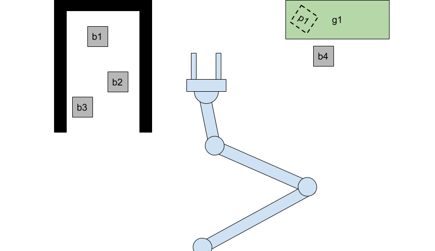

# Fear of commitment to geometric decisions

## Goals of the project

The goal of this project is to study the combination of task and motion planning, often referred to as TAMP. Specifically to study methods to make geometric decisions in support of a manipulation plan. 
An example of this is when a robot needs move one object out of the way to reach another. Where should that object be placed? A naive placement could lead to it interfering in a later step, resulting in a suboptimal plan. This highlights the need for closer collaboration between task and motion planning. In this project we will attempt to make smarter geometric decisions for a long sequence of pick and place tasks. The goal is to optimize the plan, w.r.t plan length, i.e. minimize the need to move the same objects many times.

## Motivation

In resent years there has been a surge in robotic capabilities. Falling price of sensors and increased computing power makes it cheaper and easier than ever to build advanced robots. Methods for task planning, motion planning, sensing and control have become very mature and the software is easily available. It seems that the limiting factor to building advanced robots is the interaction between these methods. The ability for robots to reliably perform a long sequence of actions in pursuit of a high level goal is still a big challenge.

The problem is in part that state of the art task planners and motion planners have no good way to work together.
Task planners are very good at finding a long, complicated sequence of actions to reach a high level goal.
Motion planners are very good at finding collision free paths between two poses in a high dimensional configuration space.

## Current state of the art

The straight forward approach is to have a task planner plan a sequence of actions and then use a motion planner to execute each action. This does not enable the task planner to make any considerations for geometric constraints. 

One common approach to extend this is to use the motion planner as a subroutine of the task planner. For every action that is considered, the motion planner is queried to check if it is geometrically feasible. This gets expensive since it requires a large number of queries to the motion planner. Some resent work has been focused on reducing number and cost of repeated queries motion planner queries.

Other approaches have attempted to combine TAMP into a single search space. Likely the most cited planner is aSyMov.

In every approach, one of the fundamental challenges is how make symbolic representations of continuous variables so they can be reasoned about at a high level. This always involves some type of discretization, sampling or enumeration.

## Statement of work

For this work I intend to use a simple simulated environment for pick-and-place tasks with a robotic arm. For simplicity I intend to use a 2D environment. This picture shows what it might look like.

### Task for the robot

The arm will need to solve tasks such as "Move *b1* to *g1*". *b1* is a box that can be manipulated, and *g1* is a goal area. To do this the arm will have to move *b2* and *b3* out of the way. This requires choosing a target pose for *b1* that is within the goal area, and choosing a pose for *b2* and *b3* that will not interfere with the rest of the plan.

The focus of this project is to find a way to choose the position for the boxes such that they don't interfere later in the plan, or do so as little as possible. This gets hard as we add more boxes and obstacles.

### Symbolic task planning and sampling based motion planning

In general, symbolic task planners cannot reason about infinite domains. Therefore choosing geometric values for the planner to use becomes a problem. A common approach is to discretize or sample the geometry to reduce the space of options to a finite set. For example, the goal area in the image above could be discretized to contain 4 predetermined box poses. 

The idea for this project is to use symbolic placeholders for the positions and not commit to a specific value until as late as possible. As tasks are planned, the motion planner is queried for feasibility, but it does not commit to specific values. Once a sequence of tasks has been planed, if the plan contains placeholder symbols, those symbols will need to instantiated with geometric values.

Some examples of what the symbolic actions might looks like:  
* *pick_up(b1)*
  * pre(*reachable(b1)*)
  * post(*holding(b1)*)
* *put(b1, g1, p1)*
  * pre(*holding(b1)* ^ *reachable(g1)*)
  * post(*at(b1, p1)* ^ *in(p1, g1)*)

  In the sample above, *p1* is a geometric placeholder for a box pose. It will need to be instantiated with a concrete value before the plan can be executed. *reachable* and *in* represent geometric feasibility checks.

### WBS
 * Implement a simple box world simulation environment with a manipulator with 3 or 4 degrees of freedom, obstacles, and boxes to manipulate.
 * Implement sampling based motion planner to find collision free paths for the manipulator.
 * Implement a propositional task planner based on the classic STRIPS planner. An actions could for example be *put(b1, p1)*, which reads as "put box 1 at pose 1".
 * Extend the task planner to include geometric template arguments, and use the motion planner to check feasibility of actions.
 * Develop method to instantiate position placeholders 

## Team

* **Gudjon Einar Magnusson** 
  
&#103;&#109;&#097;&#103;&#110;&#117;&#115;&#115;&#111;&#110;(&#097;&#116;)&#102;&#099;&#045;&#109;&#100;&#046;&#117;&#109;&#100;&#046;&#101;&#100;&#117;

---

## References

* [1] Gravot, Fabien, Stephane Cambon, and Rachid Alami. "aSyMov: a planner that deals with intricate symbolic and geometric problems." Robotics Research. The Eleventh International Symposium. Springer, Berlin, Heidelberg, 2005.
* [2] Hauser, Kris. "Task planning with continuous actions and nondeterministic motion planning queries." Proc. of AAAI Workshop on Bridging the Gap between Task and Motion Planning. 2010.
* [3] Srivastava, Siddharth, et al. "Combined task and motion planning through an extensible planner-independent interface layer." 2014 IEEE international conference on robotics and automation (ICRA). IEEE, 2014.
* [4] Kim, Beomjoon, Leslie Pack Kaelbling, and Tomás Lozano-Pérez. "Learning to guide task and motion planning using score-space representation." 2017 IEEE International Conference on Robotics and Automation (ICRA). IEEE, 2017.
* [5] Dantam, Neil T., et al. "Incremental Task and Motion Planning: A Constraint-Based Approach." Robotics: Science and systems. 2016.
* [6] Garrett, Caelan Reed, Tomás Lozano-Pérez, and Leslie Pack Kaelbling. "Strips planning in infinite domains." arXiv preprint arXiv:1701.00287 (2017).
* [7] Garrett, Caelan Reed, Tomas Lozano-Perez, and Leslie Pack Kaelbling. "FFRob: Leveraging symbolic planning for efficient task and motion planning." The International Journal of Robotics Research 37.1 (2018): 104-136.
